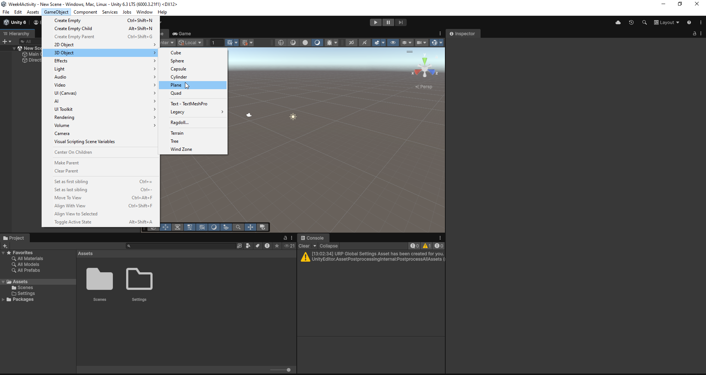
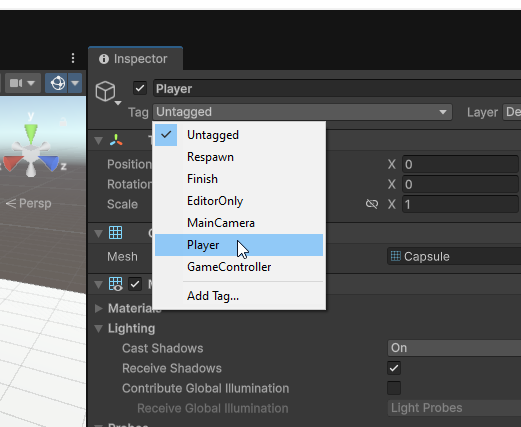
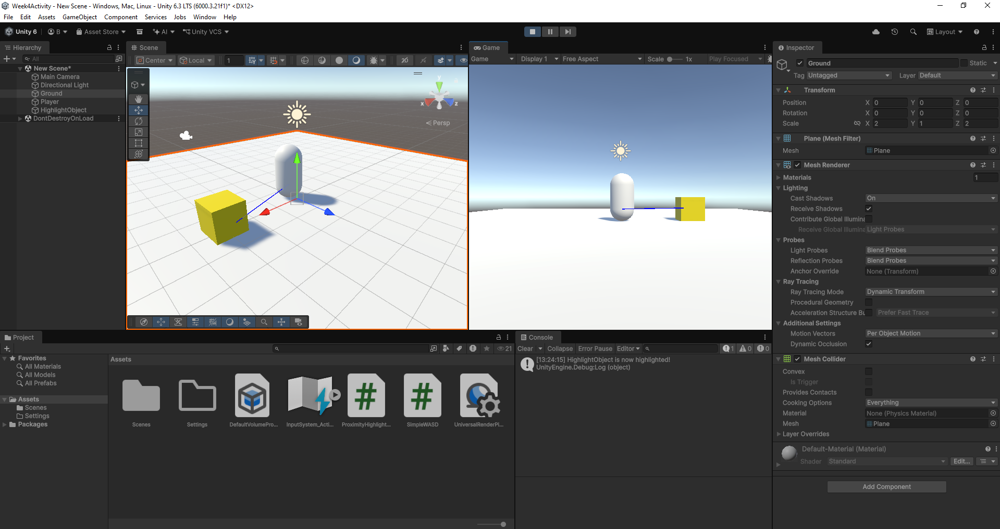
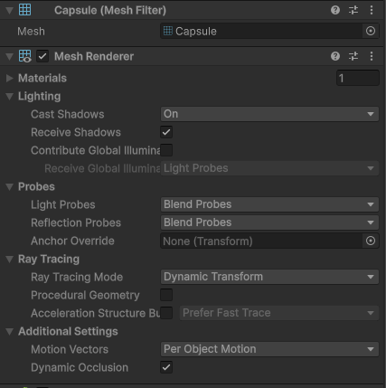

# Activity 1: Proximity-Based Object Reactions

## Objective
Create a scene where objects react to player proximity by changing colour (highlighting) or moving away from the player. This activity builds on collision detection and introduces proximity-based interactions.

## Prerequisites
- Complete Week 02 and Week 03 activities
- Understanding of Unity components (Rigidbody, Collider, Renderer)
- Basic C# scripting knowledge
- Familiarity with collision detection systems

## Instructions

### Step 1: Project Setup
1. **Open Unity 6.3 LTS (`6000.3.x`) and create a new project** using the **Universal 3D (URP)** template
2. **Save your scene immediately** (Ctrl+S) 
3. **Create an organised folder structure** in the Project window:
   - Right-click in Project window → Create → Folder
   - Name it "Scripts"

### Step 2: Create the Basic Scene
1. **Create a ground plane**:
   - GameObject → 3D Object → Plane
   - Rename it to "Ground"
   - Position at (0, 0, 0)
   - Scale to (2, 1, 2) for more space

   

2. **Create the Player**:
   - GameObject → 3D Object → Capsule
   - Rename it to "Player"
   - Position at (0, 1, 0)
   - In the Inspector, click the **Tag** dropdown and select **Player**
   - Add a Rigidbody component
   - Check **Is Kinematic** on the Rigidbody

   

> **Is Kinematic, for the same reason as Week 2.** `SimpleWASD` moves the Player by writing
> its Transform, and a normal Rigidbody would fight it. Ticking **Is Kinematic** also stops
> physics rotating the capsule, so no Freeze Rotation constraints are needed.

3. **Create the SimpleWASD script**:
   - In the Project window, right-click in the Scripts folder
   - Select `Create > C# Script`
   - Name it `SimpleWASD`
   - Write this script:
```csharp
using UnityEngine;
using UnityEngine.InputSystem;

public class SimpleWASD : MonoBehaviour
{
    public float moveSpeed = 5f;

    InputAction moveAction;

    void Start()
    {
        // Find the Move action from the project's input actions asset
        moveAction = InputSystem.actions.FindAction("Move");
    }

    void Update()
    {
        // Read the action as a 2D direction (-1 to 1 on each axis)
        Vector2 input = moveAction.ReadValue<Vector2>();

        // The action's Y (W and S) drives forward/backward movement
        Vector3 movement = new Vector3(0f, 0f, input.y);

        // The action's X (A and D) drives rotation (turning left and right)
        transform.Rotate(0f, input.x * 90f * Time.deltaTime, 0f);

        // For efficiency, we check to make sure that we need to move before calling Translate
        if (movement != Vector3.zero)
        {
            transform.Translate(movement.normalized * moveSpeed * Time.deltaTime, Space.Self);
        }
    }

    void OnDrawGizmos()
    {
        // Draw a debug ray pointing forward from the player, dropped to the height of an
        // object resting on the ground so it shows where a grab ray would really go
        Gizmos.color = Color.blue;
        Gizmos.DrawRay(transform.position + Vector3.down * 0.5f, transform.forward * 3f);
    }
}
```

   This is the same **Input System** idiom you met in [Week 02 Activity 3](../Week%2002/Activity%203%20-%20Input%20Movement.md):
   `InputSystem.actions` is the project-wide actions asset, and `FindAction("Move")` looks
   the action up by name. Because `Move` is already bound to WASD, the arrow keys, and a
   gamepad stick, you get all three without writing a line for any of them. Here the
   action's **Y** drives forward and back, while its **X** turns you rather than strafing —
   which is what makes the blue gizmo ray useful.

> **`NullReferenceException` on the `ReadValue` line?** `InputSystem.actions` is the
> project-wide actions asset, and `FindAction` hands back nothing if that asset is missing or
> unassigned. Check that **Edit → Project Settings → Input System Package → Project-wide
> Actions** points at `InputSystem_Actions`.

4. **Attach the script to the Player**:
   - Select the Player in the Hierarchy
   - Drag the SimpleWASD script from the Project window onto it
   - Leave Move Speed at 5 for now

5. **Create a highlighting object**:
   - GameObject → 3D Object → Cube
   - Rename it to "HighlightObject"
   - Position at (3, 0.5, 0)

### Step 3: Create the Basic Proximity Highlighting Script
1. **Create a new script**:
   - In the Project window, right-click in the Scripts folder
   - Select `Create > C# Script`
   - Name it `ProximityHighlighter`

2. **Write the basic proximity highlighting script**:
```csharp
using UnityEngine;

public class ProximityHighlighter : MonoBehaviour
{
    public float proximityDistance = 3f;

    public Color normalColor = Color.white;
    public Color highlightColor = Color.yellow;

    private Renderer objectRenderer;
    private bool isPlayerNearby = false;

    private GameObject player;

    void Start()
    {
        // Get the renderer component for colour changes
        objectRenderer = GetComponent<Renderer>();

        // Set initial colour
        objectRenderer.material.color = normalColor;

        // Find the player once and store the reference
        player = GameObject.FindGameObjectWithTag("Player");
    }

    void Update()
    {
        // Calculate distance to player
        float distanceToPlayer = Vector3.Distance(transform.position, player.transform.position);

        // Check if player is within proximity distance
        bool wasNearby = isPlayerNearby;
        isPlayerNearby = distanceToPlayer <= proximityDistance;

        // Handle proximity highlighting
        if (isPlayerNearby && !wasNearby)
        {
            // Player just entered proximity - highlight the object
            objectRenderer.material.color = highlightColor;
            Debug.Log(gameObject.name + " is now highlighted!");
        }
        else if (!isPlayerNearby && wasNearby)
        {
            // Player just left proximity - return to normal colour
            objectRenderer.material.color = normalColor;
            Debug.Log(gameObject.name + " returned to normal colour");
        }
    }
}
```

> **This is the "notice me" half of an interaction.** In Week 6 the XR Interaction Toolkit
> (XRI) will raise hover events for you; building it by hand now means you will recognise
> what XRI is doing when it does.

> **Getting a `NullReferenceException` every frame?** The script looks the player up by tag
> in `Start()`, so if nothing in the scene is tagged `Player` it finds nothing and every
> frame after that fails. Check the Tag dropdown you set in Step 2.

### Step 4: Configure the Highlighting Object
1. **Set up the HighlightObject**:
   - Select the HighlightObject in the Hierarchy
   - Add the ProximityHighlighter script component
   - In the Inspector, configure:
     - Proximity Distance: 3
     - Normal Color: White
     - Highlight Color: Yellow

### Step 5: Test the Proximity Highlighting System
1. **Enter Play mode**: Click the Play button
2. **Move the player around** using WASD, the arrow keys, or a gamepad stick — all three
   are bound to the same `Move` action
3. **Test proximity highlighting**:
   - Move close to the HighlightObject (within 3 units)
   - Watch it change from white to yellow
   - Move away from the object
   - Observe it return to its original white colour

   


## Understanding the Code

### **Basic Proximity Highlighting (ProximityHighlighter)**
- Uses `Vector3.Distance()` to calculate distance between objects
- Compares distance to `proximityDistance` threshold
- Tracks state changes to trigger highlighting only when entering/leaving proximity
- Accesses the object's `Renderer` component to modify material colours
- Provides immediate visual feedback when player approaches

### **Understanding the Renderer Component**
The `Renderer` component is what draws a 3D object on screen. On a Unity primitive it is a
`MeshRenderer`, and it controls:
- **Material**: The visual appearance (colour, texture, shader)
- **Visibility**: Whether the object is drawn, through its `enabled` property
- **Shadows**: Whether the object casts and receives them

The shape itself lives next door on the **MeshFilter**, which is the component that holds the
mesh. The MeshFilter says what the shape is; the Renderer says how it looks.



**How we use it:**
- `GetComponent<Renderer>()` gets the Renderer component from our object
- `objectRenderer.material.color` changes the colour of the object's material
- This gives us instant visual feedback when the player approaches

### **State Change Detection with Flags**
The script uses two boolean flags to detect when the player enters or leaves the proximity zone:

**`isPlayerNearby`**: Current state (true = player is close, false = player is far)  
**`wasNearby`**: Previous state (what the state was in the last frame)  
**`!`**: The `not` operator inverts the boolean logic. `!true = false`

**How it works:**
1. **Store previous state**: `bool wasNearby = isPlayerNearby;` (saves current state before updating)
2. **Update current state**: `isPlayerNearby = distanceToPlayer <= proximityDistance;` (checks if player is now close)
3. **Detect changes**:
   - `isPlayerNearby && !wasNearby` = Player just entered proximity (was far, now close)
   - `!isPlayerNearby && wasNearby` = Player just left proximity (was close, now far)

**Why this matters:**
Without flags, the object would change colour every frame while the player is nearby, causing unnecessary updates. With flags, the colour only changes when the player actually enters or leaves the zone - a much more efficient and logical system.

### **Understanding Unity Tags**
Tags are labels you can assign to GameObjects to identify them in your code. Think of them as sticky notes that help your scripts find specific objects.

**How tags work:**
- **Tag Assignment**: In the Inspector, click the Tag dropdown and select or create a tag
- **Finding Objects**: `GameObject.FindGameObjectWithTag("Player")` returns an object carrying that tag
- **Lookup cost**: Unity keeps a list of tagged objects, so the search does not walk the whole scene

**Three ways to reach another object, fastest first:**

| Approach | How | When to use it |
|---|---|---|
| **Inspector reference** | `public Transform player;`, then drag the object into the field | Whenever you can wire it by hand. Nothing is searched for at all, and a missing reference shows up as an empty field in the Inspector |
| **Find by tag** | `GameObject.FindGameObjectWithTag("Player")` | When the same script sits on many objects, or on something spawned while the game runs, and dragging a reference into each one is impractical |
| **Find by name** | `GameObject.Find("Player")` | Rarely. It searches the whole scene and breaks the moment somebody renames the object |

Weeks 2 and 3 used the first one — you dragged Transforms into `UsefulMath` and `UIManager`.
This activity uses a tag because `ProximityHighlighter` goes on every object that reacts, and
each copy needs to find the same player.

**Best practices:**
- Use descriptive tag names: "Player", "Enemy", "Collectible", "Obstacle"
- Keep tag names consistent across your project
- Tags are case-sensitive, so "Player" ≠ "player"
- A tag lookup returns `null` when nothing carries the tag, and you find out at runtime. An Inspector reference you forgot to fill is visible before you press Play

## Extension Activities

### **Expand Your Scene**
1. **Add more highlighting objects**:
   - Duplicate existing objects
   - Create new primitive shapes (Sphere, Cylinder)
   - Configure different proximity distances
   - Try different highlight colours

2. **Experiment with different settings**:
   - Try different proximity distances
   - Test various colours
   - Adjust highlight timing
   - Create colour gradients

### **Make objects move away from the player**
**Challenge**: Add movement behaviour so objects move away when the player gets too close, then return to their original position when the player leaves.

**Logic to implement**:
1. Store the object's starting position when the script begins
2. When the player is nearby, calculate a direction away from the player
3. Move the object in that direction using `Vector3.MoveTowards()`
4. When the player leaves, move the object back to its original position

**Key code you'll need**:
- Store position: `originalPosition = transform.position;`
- Calculate direction away: `(transform.position - player.transform.position).normalized`
- Move object: `transform.position = Vector3.MoveTowards(transform.position, targetPosition, moveSpeed * Time.deltaTime)`

Work out the target position once, on the frame the player arrives, using the same
`wasNearby` flag pattern as the highlighter. Recalculate it every frame and the target drags
along behind the object as it retreats.

### **Add Sound Effects**
**Challenge**: Make objects play a sound when the player enters or leaves their proximity zone.

**Logic to implement**:
1. Add an AudioSource component to your object
2. Assign an audio clip to play when proximity changes
3. Play the sound at the same time the colour changes

**Key code you'll need**:
- Add variables: `public AudioSource audioSource;` and `public AudioClip proximitySound;`
- Add and reference AudioSource component: `GetComponent<AudioSource>()`
- Play sound: `audioSource.PlayOneShot(proximitySound)`
- Check if components exist: `if (audioSource && proximitySound)`

### **Create Different Reaction Types**
**Challenge**: Add rotation and scaling effects when objects are highlighted, making them more dynamic.

**Logic to implement**:
1. Add boolean flags to enable/disable rotation and scaling
2. When player is nearby, rotate the object around its Y-axis
3. When player is nearby, scale the object up; when they leave, scale back down
4. Use the existing `isPlayerNearby` flag to control when effects happen

**Key code you'll need**:
- Add variables: `public bool rotateOnProximity = true;` and `public float rotationSpeed = 90f;`
- Store the starting scale: `originalScale = transform.localScale;`
- Rotate object: `transform.Rotate(Vector3.up * rotationSpeed * Time.deltaTime)`
- Scale object: `transform.localScale = originalScale * scaleMultiplier`
- Reset scale: `transform.localScale = originalScale`

Scale from `originalScale` rather than `Vector3.one`, or any object you resized in the
Inspector will snap to a different size the first time the player walks past it.

## Outcome
A scene with a player you drive from WASD, the arrow keys or a gamepad, and an object that
notices you approaching and changes colour to say so. You have measured distance with
`Vector3.Distance`, found another object by tag, changed a material at runtime, and used a
pair of boolean flags to act on the moment a state changes rather than on every frame it
holds.

## Save Your Work
**Don't forget to save your scene and project!**
- Press Ctrl+S (Windows) or Cmd+S (Mac) to save your scene
- Go to File → Save Project to save all your work
