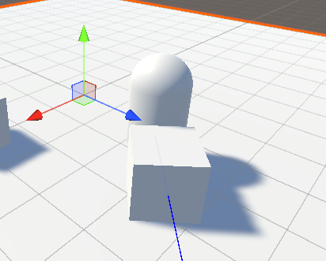
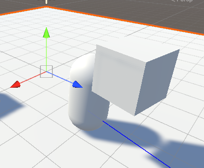

# Activity 2: Object Selection and Throwing

## Objective
Create a scene where a player can move around, select objects by pressing the `Interact` key when near them, and throw selected objects by pressing it again. This activity builds on proximity detection and introduces object parenting and physics.

## Prerequisites
- Complete Week 02 and Week 03 activities
- Complete Week 04 Activity 1 (Proximity Reactions)
- Basic C# scripting knowledge

## Instructions

### Step 1: Project Setup
1. **Open your Week 4 Activity 1 scene**
2. **Save your scene** (Ctrl+S)
3. **Ensure you have**: Ground, Player with SimpleWASD script, and some objects

### Step 2: Create a Simple Grabbable Script
1. **Create a new script** called `Grabbable`
2. **Write this simple script**:
```csharp
using UnityEngine;

public class Grabbable : MonoBehaviour
{
    public bool isGrabbed = false;

    void Start()
    {
        // Make sure object has a Rigidbody
        if (GetComponent<Rigidbody>() == null)
        {
            gameObject.AddComponent<Rigidbody>();
        }
    }
}
```

3. **Create a cube for it to go on**:
   - GameObject → 3D Object → Cube
   - Rename it to "GrabbableObject" — later steps refer to it by that name
   - Position it at (0, 0.5, 3), straight ahead of where the Player starts
   - Add the Grabbable script component

   Make a new cube rather than reusing HighlightObject. That one keeps the highlighting job
   you gave it in Activity 1.

### Step 3: Create the Player Script with Stubbed Functions

You will drive grabbing and throwing from the **Input System**'s `Interact` action, the same
way Activity 1 drives movement from `Move`. Open **Edit → Project Settings → Input System
Package**, click through to the project-wide `InputSystem_Actions` asset, and look at
`Interact` under the **Player** action map. On a keyboard it is bound to **E**. Confirm that
in the asset before you go on, because everything below says "press the `Interact` key".

1. **Create a new script** called `PlayerGrabber`
2. **Write this script to set up the grab and throw functionality.** This version is
   deliberately incomplete — the two functions are stubs you will fill in over Steps 5 to 7.
   The finished script appears at the end of Step 7, and in
   [`Scripts/PlayerGrabber.cs`](Scripts/PlayerGrabber.cs).
```csharp
using UnityEngine;
using UnityEngine.InputSystem;

public class PlayerGrabber : MonoBehaviour
{
    public float grabDistance = 3f;
    private GameObject grabbedObject = null;

    InputAction interactAction;

    void Start()
    {
        // Find the Interact action from the project's input actions asset
        interactAction = InputSystem.actions.FindAction("Interact");
    }

    void Update()
    {
        if (interactAction.WasPressedThisFrame())
        {
            if (grabbedObject == null)
            {
                GrabObject();
            }
            else
            {
                ThrowObject();
            }
        }
    }

    void GrabObject()
    {
        // TODO: Implement grab logic
        Debug.Log("Grab function called - not yet implemented");
    }

    void ThrowObject()
    {
        // TODO: Implement throw logic
        Debug.Log("Throw function called - not yet implemented");
    }
}
```

`WasPressedThisFrame()` is true only on the frame the key goes down, which is what you want
for a one-shot action like grabbing. Compare it with `IsPressed()`, which stays true for as
long as you hold the key.

> **`Interact` carries a Hold interaction, and it makes no difference here.**
> `WasPressedThisFrame()` reports the key crossing the press threshold whether or not an
> interaction has performed the action yet. Use `WasPerformedThisFrame()` instead and you
> would have to hold E down for a moment before anything happened.

3. **Add this script to your Player**

### Step 4: Test the Basic Structure
1. **Enter Play mode**
2. **Move close to the GrabbableObject**
3. **Press the `Interact` key (E) near the object**:
   - Watch the Console for debug messages
   - Verify that "Grab function called - not yet implemented" appears
4. **Press it again, and again**:
   - Verify that the *same* line appears each time

**Expected behaviour**: "Grab function called - not yet implemented" is the only message you
will see, however many times you press the key, and nothing in the scene moves. `Update()`
calls `ThrowObject()` only when `grabbedObject` is not null, and the empty `GrabObject()`
never sets it.

### Step 5: Implement the Grab Function
1. **Update the GrabObject function** in your PlayerGrabber script:
```csharp
    void GrabObject()
    {
        // Find objects with Grabbable script
        Grabbable[] grabbables = FindObjectsByType<Grabbable>(FindObjectsSortMode.None);

        foreach (Grabbable grabbable in grabbables)
        {
            if (!grabbable.isGrabbed)
            {
                float distance = Vector3.Distance(transform.position, grabbable.transform.position);
                if (distance <= grabDistance)
                {
                    // Grab the first object we find
                    grabbedObject = grabbable.gameObject;
                    grabbable.isGrabbed = true;

                    // Make object follow player
                    grabbedObject.transform.SetParent(transform);
                    grabbedObject.transform.localPosition = new Vector3(0, 1, 1);

                    Debug.Log("Grabbed: " + grabbedObject.name);
                    break;
                }
            }
        }
    }
```

`FindObjectsByType` replaces the older `FindObjects…` call you may see in tutorials. Passing
`FindObjectsSortMode.None` tells Unity not to bother sorting the results, which is the
cheaper option and all you need here. Note that it hands back the objects in no particular
order, so this grabs the first one it finds within range, not the closest one.

2. **Test the grab functionality**:
   - Enter Play mode
   - Move close to the GrabbableObject (within 3 units)
   - Press the `Interact` key
   - Watch the Console confirm the grab, then watch the cube drop to the floor
   - Move around. The cube slides along the ground after you instead of being carried

### Step 6: Stop the Object Falling Out of Your Hands

**Notice what happened.** With the cube held, look at the Hierarchy: `GrabbableObject` is
indented underneath `Player`, so the parenting worked. Then look at the Scene view: the cube
is lying on the floor, dragging along behind you.



**Why it happens.** Parenting changes what a Transform's position is measured *relative to*.
It does not take the object out of the physics simulation. `Grabbable` gives every grabbable
object a Rigidbody, that Rigidbody is still being simulated in world space, and every physics
step gravity writes a fresh world position over the local position you set at the moment of
the grab.

**Fix it.** Take the object out of the simulation while it is held.

1. **Add these lines to `GrabObject`**, just after `grabbable.isGrabbed = true;`:
```csharp
                    // Take the object out of the physics simulation while it is held
                    Rigidbody rb = grabbedObject.GetComponent<Rigidbody>();
                    if (rb != null)
                    {
                        rb.isKinematic = true;
                    }
```

2. **Test again**:
   - Enter Play mode
   - Grab the cube and move around
   - The cube now stays where you put it, in front of the player, and turns with you

   

> **A kinematic Rigidbody still exists, it just stops listening to physics.** Gravity and
> forces no longer move it, and your Transform writes are the only thing positioning it.
> Untick the box and physics takes over again.

You have now made a decision every grab system has to make: while an object is held, does
physics own its position, or do you? In Week 6 you will find this exact choice waiting for
you as the **Movement Type** dropdown on `XRGrabInteractable`.

### Step 7: Implement the Throw Function
1. **Update the ThrowObject function** in your PlayerGrabber script:
```csharp
    void ThrowObject()
    {
        if (grabbedObject != null)
        {
            // Release object
            grabbedObject.transform.SetParent(null);

            // Get the Grabbable component and mark as not grabbed
            Grabbable grabbable = grabbedObject.GetComponent<Grabbable>();
            if (grabbable != null)
            {
                grabbable.isGrabbed = false;
            }

            // Apply throwing force
            Rigidbody rb = grabbedObject.GetComponent<Rigidbody>();
            if (rb != null)
            {
                // Hand the object back to physics before applying force
                rb.isKinematic = false;
                rb.AddForce(transform.forward * 10f, ForceMode.Impulse);
            }

            Debug.Log("Threw: " + grabbedObject.name);
            grabbedObject = null;
        }
    }
```

> **Those two lines are in that order for a reason.** Force applied to a kinematic Rigidbody
> is discarded. Set `isKinematic` back to `false` first, then throw.

2. **Test the complete grab and throw system**:
   - Enter Play mode
   - Move close to the GrabbableObject
   - Press the `Interact` key to grab it
   - Move around to position yourself
   - Press it again to throw it
   - The object should fly forward and fall with physics

3. **Check your finished script.** With both functions filled in, `PlayerGrabber` reads:
```csharp
using UnityEngine;
using UnityEngine.InputSystem;

public class PlayerGrabber : MonoBehaviour
{
    public float grabDistance = 3f;
    private GameObject grabbedObject = null;

    InputAction interactAction;

    void Start()
    {
        // Find the Interact action from the project's input actions asset
        interactAction = InputSystem.actions.FindAction("Interact");
    }

    void Update()
    {
        if (interactAction.WasPressedThisFrame())
        {
            if (grabbedObject == null)
            {
                GrabObject();
            }
            else
            {
                ThrowObject();
            }
        }
    }

    void GrabObject()
    {
        // Find objects with Grabbable script
        Grabbable[] grabbables = FindObjectsByType<Grabbable>(FindObjectsSortMode.None);

        foreach (Grabbable grabbable in grabbables)
        {
            if (!grabbable.isGrabbed)
            {
                float distance = Vector3.Distance(transform.position, grabbable.transform.position);
                if (distance <= grabDistance)
                {
                    // Grab the first object we find
                    grabbedObject = grabbable.gameObject;
                    grabbable.isGrabbed = true;

                    // Take the object out of the physics simulation while it is held
                    Rigidbody rb = grabbedObject.GetComponent<Rigidbody>();
                    if (rb != null)
                    {
                        rb.isKinematic = true;
                    }

                    // Make object follow player
                    grabbedObject.transform.SetParent(transform);
                    grabbedObject.transform.localPosition = new Vector3(0, 1, 1);

                    Debug.Log("Grabbed: " + grabbedObject.name);
                    break;
                }
            }
        }
    }

    void ThrowObject()
    {
        if (grabbedObject != null)
        {
            // Release object
            grabbedObject.transform.SetParent(null);

            // Get the Grabbable component and mark as not grabbed
            Grabbable grabbable = grabbedObject.GetComponent<Grabbable>();
            if (grabbable != null)
            {
                grabbable.isGrabbed = false;
            }

            // Apply throwing force
            Rigidbody rb = grabbedObject.GetComponent<Rigidbody>();
            if (rb != null)
            {
                // Hand the object back to physics before applying force
                rb.isKinematic = false;
                rb.AddForce(transform.forward * 10f, ForceMode.Impulse);
            }

            Debug.Log("Threw: " + grabbedObject.name);
            grabbedObject = null;
        }
    }
}
```

> **You have just hand-built *notice / hold / release*.** In Week 6 the XR
> Interaction Toolkit (XRI) does all three for you.

### Step 8: Create Multiple Grabbable Objects
1. **Duplicate your GrabbableObject**:
   - Select the GrabbableObject in the Hierarchy
   - Press Ctrl+D (Windows) or Cmd+D (Mac) to duplicate
   - Position the duplicate at (3, 0.5, 3)
   - Rename it to "GrabbableObject2"

2. **Create a third object**:
   - GameObject → 3D Object → Sphere
   - Rename it to "GrabbableSphere"
   - Position it at (-3, 0.5, 3)
   - Add the Grabbable script component

3. **Test with multiple objects**:
   - Enter Play mode
   - Try grabbing different objects
   - Notice that you can only grab one object at a time
   - Test throwing and then grabbing another object

### Step 9: Implement Raycast-Based Selection (Optional)
1. **Replace the GrabObject function** with raycast-based selection:
```csharp
    void GrabObject()
    {
        // Cast level with an object resting on the ground, not from the capsule's centre
        Ray ray = new Ray(transform.position + Vector3.down * 0.5f, transform.forward);
        RaycastHit hit;

        if (Physics.Raycast(ray, out hit, grabDistance))
        {
            Grabbable grabbable = hit.collider.GetComponent<Grabbable>();
            if (grabbable != null && !grabbable.isGrabbed)
            {
                // Grab the object we're looking at
                grabbedObject = grabbable.gameObject;
                grabbable.isGrabbed = true;

                // Take the object out of the physics simulation while it is held
                Rigidbody rb = grabbedObject.GetComponent<Rigidbody>();
                if (rb != null)
                {
                    rb.isKinematic = true;
                }

                // Make object follow player
                grabbedObject.transform.SetParent(transform);
                grabbedObject.transform.localPosition = new Vector3(0, 1, 1);

                Debug.Log("Grabbed: " + grabbedObject.name + " using raycast");
            }
        }
    }
```

> **Where a ray starts matters as much as where it points.** The Player capsule's origin is
> at its centre, a metre off the ground, while a cube resting on the floor has its top face
> at exactly that height. A ray fired from `transform.position` skims over the objects you
> are trying to grab. Dropping the origin half a metre puts it through their middles — and
> the blue gizmo ray from `SimpleWASD` is drawn at that same height so you can see where it
> goes.

2. **Test the raycast system**:
   - Enter Play mode
   - Look at an object with the `Grabbable` script (turn to face it)
   - Press the `Interact` key to grab it
   - The object should only be grabbed if you're looking directly at it
   - Try looking away and pressing the `Interact` key - nothing should happen

If you would rather keep both versions side by side, save the raycast variant as its own
script called `PlayerGrabberRaycast`:
```csharp
using UnityEngine;
using UnityEngine.InputSystem;

public class PlayerGrabberRaycast : MonoBehaviour
{
    public float grabDistance = 3f;
    private GameObject grabbedObject = null;

    InputAction interactAction;

    void Start()
    {
        // Find the Interact action from the project's input actions asset
        interactAction = InputSystem.actions.FindAction("Interact");
    }

    void Update()
    {
        if (interactAction.WasPressedThisFrame())
        {
            if (grabbedObject == null)
            {
                GrabObject();
            }
            else
            {
                ThrowObject();
            }
        }
    }

    void GrabObject()
    {
        // Cast level with an object resting on the ground, not from the capsule's centre
        Ray ray = new Ray(transform.position + Vector3.down * 0.5f, transform.forward);
        RaycastHit hit;

        if (Physics.Raycast(ray, out hit, grabDistance))
        {
            Grabbable grabbable = hit.collider.GetComponent<Grabbable>();
            if (grabbable != null && !grabbable.isGrabbed)
            {
                // Grab the object we're looking at
                grabbedObject = grabbable.gameObject;
                grabbable.isGrabbed = true;

                // Take the object out of the physics simulation while it is held
                Rigidbody rb = grabbedObject.GetComponent<Rigidbody>();
                if (rb != null)
                {
                    rb.isKinematic = true;
                }

                // Make object follow player
                grabbedObject.transform.SetParent(transform);
                grabbedObject.transform.localPosition = new Vector3(0, 1, 1);

                Debug.Log("Grabbed: " + grabbedObject.name + " using raycast");
            }
        }
    }

    void ThrowObject()
    {
        if (grabbedObject != null)
        {
            // Release object
            grabbedObject.transform.SetParent(null);

            // Get the Grabbable component and mark as not grabbed
            Grabbable grabbable = grabbedObject.GetComponent<Grabbable>();
            if (grabbable != null)
            {
                grabbable.isGrabbed = false;
            }

            // Apply throwing force
            Rigidbody rb = grabbedObject.GetComponent<Rigidbody>();
            if (rb != null)
            {
                // Hand the object back to physics before applying force
                rb.isKinematic = false;
                rb.AddForce(transform.forward * 10f, ForceMode.Impulse);
            }

            Debug.Log("Threw: " + grabbedObject.name);
            grabbedObject = null;
        }
    }
}
```

Put only one of the two scripts on the Player at a time, or they will fight over the same
object.

## Understanding the Code

### **Object Parenting**
- `transform.SetParent(transform)` makes the object a child of the player
- `transform.localPosition` positions the object relative to the player
- When the player moves, the child object moves with it
- Parenting changes what a position is measured against. It does not stop physics simulating the object

### **Holding and Releasing a Physics Object**
- `rb.isKinematic = true` takes the object out of the simulation, so the position you set is the position it keeps
- `rb.isKinematic = false` hands it back to physics, and has to happen before you apply any force
- This is the choice `XRGrabInteractable` exposes as **Movement Type** in Week 6

### **Physics and Throwing**
- `rb.AddForce()` applies force to make objects move
- `ForceMode.Impulse` gives instant force (like throwing)
- The object falls with gravity after being thrown

### **Simple State Management**
- `isGrabbed` boolean tracks if an object is currently held
- `grabbedObject` reference stores which object we're holding
- We can only hold one object at a time

## Extension Activities

### **Simple Improvements**
1. **Change throw direction**: Modify the throw force to go up: `transform.forward + transform.up`
2. **Add sound**: Play a sound when grabbing/throwing (use AudioSource)
3. **Visual feedback**: Change object colour when grabbed

### **Velocity-Based Throwing**
**Challenge**: Replace the simple `AddForce` throwing with velocity-based throwing that feels more natural.

**Implementation**:
1. **Replace the throwing code** in your `ThrowObject()` function, inside the
   `if (rb != null)` block, keeping the `isKinematic` line at the top:
```csharp
                // Hand the object back to physics before setting its velocity
                rb.isKinematic = false;

                // Calculate throw velocity
                Vector3 throwDirection = transform.forward;
                float throwSpeed = 10f;

                // Add upward component for natural arc, then normalise so the speed you
                // asked for is the speed you get
                Vector3 throwVelocity = (throwDirection + Vector3.up * 0.3f).normalized * throwSpeed;

                // Apply velocity directly
                rb.linearVelocity = throwVelocity;
```

   Note the property name: a Rigidbody's velocity is `linearVelocity` in Unity 6.3 LTS
   (`6000.3.x`). Older tutorials use a shorter name that no longer exists.

2. **What actually changes**:
   - `AddForce(…, ForceMode.Impulse)` changes velocity by force ÷ mass, so the same code throws a heavy object more slowly than a light one
   - Assigning `linearVelocity` sets the speed directly whatever the object weighs, and discards any velocity it already had
   - `.normalized` matters here. `forward + up * 0.3` is about 1.04 units long, so without it the throw comes out 4% faster than the number you typed

3. **The whole variant**, saved as `PlayerGrabberVelocity`:
```csharp
using UnityEngine;
using UnityEngine.InputSystem;

public class PlayerGrabberVelocity : MonoBehaviour
{
    public float grabDistance = 3f;
    private GameObject grabbedObject = null;

    InputAction interactAction;

    void Start()
    {
        // Find the Interact action from the project's input actions asset
        interactAction = InputSystem.actions.FindAction("Interact");
    }

    void Update()
    {
        if (interactAction.WasPressedThisFrame())
        {
            if (grabbedObject == null)
            {
                GrabObject();
            }
            else
            {
                ThrowObject();
            }
        }
    }

    void GrabObject()
    {
        // Find objects with Grabbable script
        Grabbable[] grabbables = FindObjectsByType<Grabbable>(FindObjectsSortMode.None);

        foreach (Grabbable grabbable in grabbables)
        {
            if (!grabbable.isGrabbed)
            {
                float distance = Vector3.Distance(transform.position, grabbable.transform.position);
                if (distance <= grabDistance)
                {
                    // Grab the first object we find
                    grabbedObject = grabbable.gameObject;
                    grabbable.isGrabbed = true;

                    // Take the object out of the physics simulation while it is held
                    Rigidbody rb = grabbedObject.GetComponent<Rigidbody>();
                    if (rb != null)
                    {
                        rb.isKinematic = true;
                    }

                    // Make object follow player
                    grabbedObject.transform.SetParent(transform);
                    grabbedObject.transform.localPosition = new Vector3(0, 1, 1);

                    Debug.Log("Grabbed: " + grabbedObject.name);
                    break;
                }
            }
        }
    }

    void ThrowObject()
    {
        if (grabbedObject != null)
        {
            // Release object
            grabbedObject.transform.SetParent(null);

            // Get the Grabbable component and mark as not grabbed
            Grabbable grabbable = grabbedObject.GetComponent<Grabbable>();
            if (grabbable != null)
            {
                grabbable.isGrabbed = false;
            }

            // Apply throwing velocity for a more natural arc
            Rigidbody rb = grabbedObject.GetComponent<Rigidbody>();
            if (rb != null)
            {
                // Hand the object back to physics before setting its velocity
                rb.isKinematic = false;

                // Calculate throw velocity
                Vector3 throwDirection = transform.forward;
                float throwSpeed = 10f;

                // Add upward component for natural arc, then normalise so the speed you
                // asked for is the speed you get
                Vector3 throwVelocity = (throwDirection + Vector3.up * 0.3f).normalized * throwSpeed;

                // Apply velocity directly
                rb.linearVelocity = throwVelocity;

                Debug.Log("Threw: " + grabbedObject.name + " with velocity: " + throwVelocity);
            }

            grabbedObject = null;
        }
    }
}
```

### **Advanced Challenges**
1. **Pull objects towards you**: Instead of grabbing, apply force towards the player
2. **Collision-based grabbing**: Automatically grab objects when you touch them
3. **Throw all objects in proximity**: Throw multiple objects away from you at once

### **First-Person Camera Movement**
**Challenge**: Make the camera follow the player's movement and rotation for a first-person experience.

**Implementation**:
1. **Find the Main Camera** in your scene (usually at the top of the Hierarchy)
2. **Drag the camera** to be a child of the Player object
3. **Position the camera** relative to the player:
   - Set the camera's Local Position to (0, 0.8, 0). The capsule's centre sits a metre off
     the ground, so that puts the camera at about 1.8 m — roughly eye height
   - The camera will now move and rotate with the player
4. **Test the system**:
   - Enter Play mode
   - Move with WASD and turn with A/D
   - The camera follows your movement and rotation

**Why this is useful**:
- **Better immersion**: You see the world from the player's position
- **Easier object interaction**: You look directly at what you want to grab, which is what the raycast version of `GrabObject()` needs

> **This has the shape of VR, not the mechanism.** Here you set the camera's local position
> and the camera goes there. In XR you never do that — the headset's tracking writes the
> camera's position every frame, and anything you write is overwritten. Week 5 covers what
> you move instead.

**Advanced camera setup**:
- Try different camera heights: (0, 0.2, 0) puts you at about 1.2 m, a crouch; (0, 0.95, 0) at about 1.95 m, a tall character
- Add camera smoothing by adjusting the camera's position gradually
- Experiment with different field of view (FOV) settings in the camera component

## Outcome
A player who can walk up to an object, pick it up, carry it, and throw it back into the
physics simulation, driven entirely by the `Interact` action rather than a hard-coded key.
You have parented one Transform to another, discovered for yourself that parenting does not
suspend physics, and used `isKinematic` to decide who owns an object's position while it is
held — the same decision the XR Interaction Toolkit makes for you in Week 6.

## Save Your Work
**Don't forget to save your scene and project!**
- Press Ctrl+S (Windows) or Cmd+S (Mac) to save your scene
- Go to File → Save Project to save all your work
